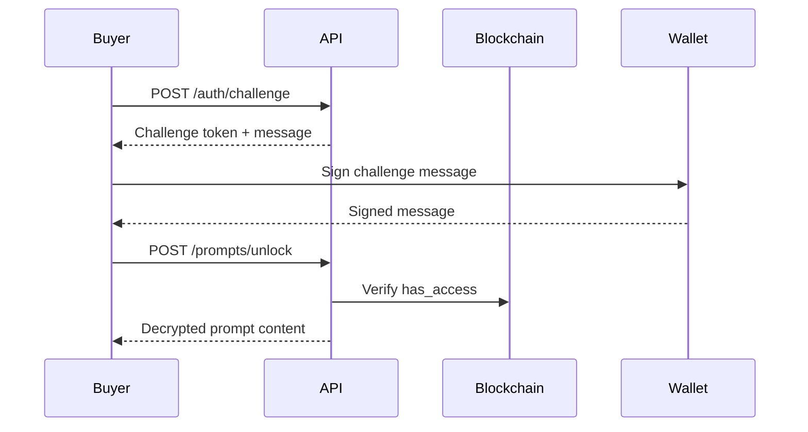

# API Reference - Unlock Service

## Overview

The PromptHash Stellar unlock service provides a secure challenge-response authentication system for gated content delivery. This API enables buyers to unlock purchased prompt content after proving wallet ownership and on-chain access rights.

## Base URL

```
Production: https://your-domain.com/api
Development: http://localhost:3000/api
```

## Authentication Flow

The unlock process follows a two-step challenge-response protocol:

1. **Challenge Issuance**: Request a time-limited challenge token
2. **Content Unlock**: Submit signed challenge to receive decrypted content



## Endpoints

### 1. Issue Challenge Token

Request a challenge token for prompt unlock authentication.

**Endpoint:** `POST /auth/challenge`

**Rate Limits:**
- IP-based: 10 requests per minute
- Applies to all requests from the same IP address

**Request Headers:**
```http
Content-Type: application/json
```

**Request Body:**
```json
{
  "address": "GABC...XYZ",
  "promptId": "123"
}
```

**Request Parameters:**

| Field | Type | Required | Description |
|-------|------|----------|-------------|
| `address` | string | Yes | Stellar public key (G-address) of the buyer |
| `promptId` | string | Yes | Unique identifier of the prompt to unlock |

**Success Response (200 OK):**
```json
{
  "token": "eyJhZGRyZXNzIjoiR0FCQy4uLlhZWiIsInByb21wdElkIjoiMTIzIiwibm9uY2UiOiI4ZjQ3YTNiMS0yZDVlLTRjOGEtYjk2Zi0xZTNhNGY1YjZjN2QiLCJleHBpcmVzQXQiOjE3MTQ1NjcyMDB9.a3b2c1d4e5f6g7h8i9j0k1l2m3n4o5p6q7r8s9t0u1v2w3x4y5z6",
  "challenge": "prompt-hash unlock:GABC...XYZ:123:8f47a3b1-2d5e-4c8a-b96f-1e3a4f5b6c7d:1714567200",
  "expiresAt": 1714567200,
  "nonce": "8f47a3b1-2d5e-4c8a-b96f-1e3a4f5b6c7d"
}
```

**Response Fields:**

| Field | Type | Description |
|-------|------|-------------|
| `token` | string | Server-signed JWT-like token for unlock request |
| `challenge` | string | Message that must be signed by the buyer's wallet |
| `expiresAt` | number | Unix timestamp (milliseconds) when token expires |
| `nonce` | string | Unique UUID preventing replay attacks |

**Error Responses:**

**400 Bad Request:**
```json
{
  "error": "address and promptId are required."
}
```

**429 Too Many Requests:**
```json
{
  "error": "Too many requests. Please try again later.",
  "reset": 1714567200
}
```

**500 Internal Server Error:**
```json
{
  "error": "Configuration error."
}
```

**Example Request:**
```bash
curl -X POST https://your-domain.com/api/auth/challenge \
  -H "Content-Type: application/json" \
  -d '{
    "address": "GABC123XYZ456DEF789GHI012JKL345MNO678PQR901STU234VWX567YZ",
    "promptId": "42"
  }'
```

**Example Response:**
```json
{
  "token": "eyJhZGRyZXNzIjoiR0FCQzEyM1hZWjQ1NkRFRjc4OUdISTAxMkpLTDM0NU1OTzY3OFBRUjkwMVNUVTIzNFZXWDU2N1laIiwicHJvbXB0SWQiOiI0MiIsIm5vbmNlIjoiYTFiMmMzZDQtZTVmNi00N2g4LWk5ajAtazFsMm0zbjRvNXA2IiwiZXhwaXJlc0F0IjoxNzE0NTY3MjAwfQ.dGhpc19pc19hX3NpZ25hdHVyZV9leGFtcGxl",
  "challenge": "prompt-hash unlock:GABC123XYZ456DEF789GHI012JKL345MNO678PQR901STU234VWX567YZ:42:a1b2c3d4-e5f6-47h8-i9j0-k1l2m3n4o5p6:1714567200",
  "expiresAt": 1714567200,
  "nonce": "a1b2c3d4-e5f6-47h8-i9j0-k1l2m3n4o5p6"
}
```

---

### 2. Unlock Prompt Content

Submit signed challenge to unlock and decrypt purchased prompt content.

**Endpoint:** `POST /prompts/unlock`

**Rate Limits:**
- IP-based: 5 requests per minute
- Wallet-based: 10 requests per minute per address
- Stricter limits prevent brute-force signature attacks

**Request Headers:**
```http
Content-Type: application/json
```

**Request Body:**
```json
{
  "token": "eyJhZGRyZXNzIjoiR0FCQy4uLlhZWiIsInByb21wdElkIjoiMTIzIiwibm9uY2UiOiI4ZjQ3YTNiMS0yZDVlLTRjOGEtYjk2Zi0xZTNhNGY1YjZjN2QiLCJleHBpcmVzQXQiOjE3MTQ1NjcyMDB9.a3b2c1d4e5f6g7h8i9j0k1l2m3n4o5p6q7r8s9t0u1v2w3x4y5z6",
  "promptId": "123",
  "address": "GABC...XYZ",
  "signedMessage": "dGhpc19pc19hX3NpZ25lZF9tZXNzYWdlX2V4YW1wbGU="
}
```

**Request Parameters:**

| Field | Type | Required | Description |
|-------|------|----------|-------------|
| `token` | string | Yes | Challenge token from `/auth/challenge` |
| `promptId` | string | Yes | Unique identifier of the prompt to unlock |
| `address` | string | Yes | Stellar public key (G-address) of the buyer |
| `signedMessage` | string | Yes | Base64-encoded signature of the challenge message |

**Success Response (200 OK):**
```json
{
  "promptId": "123",
  "title": "Advanced ChatGPT Prompt for Market Analysis",
  "contentHash": "a3f5b2c8d1e4f7g9h0i2j3k4l5m6n7o8p9q0r1s2t3u4v5w6x7y8z9",
  "plaintext": "You are an expert market analyst with 20 years of experience..."
}
```

**Response Fields:**

| Field | Type | Description |
|-------|------|-------------|
| `promptId` | string | Unique identifier of the unlocked prompt |
| `title` | string | Title of the prompt |
| `contentHash` | string | SHA-256 hash of the plaintext content |
| `plaintext` | string | Decrypted full prompt content |

**Error Responses:**

**400 Bad Request:**
```json
{
  "error": "token, promptId, address, and signedMessage are required."
}
```

**401 Unauthorized:**
```json
{
  "error": "Invalid wallet signature."
}
```

**403 Forbidden:**
```json
{
  "error": "Prompt access has not been purchased."
}
```

**429 Too Many Requests:**
```json
{
  "error": "Too many requests. Please try again later."
}
```

or

```json
{
  "error": "Too many unlock attempts for this wallet."
}
```

**500 Internal Server Error:**
```json
{
  "error": "Configuration error."
}
```

or

```json
{
  "error": "Prompt integrity check failed."
}
```

**Example Request:**
```bash
curl -X POST https://your-domain.com/api/prompts/unlock \
  -H "Content-Type: application/json" \
  -d '{
    "token": "eyJhZGRyZXNzIjoiR0FCQzEyM1hZWjQ1NkRFRjc4OUdISTAxMkpLTDM0NU1OTzY3OFBRUjkwMVNUVTIzNFZXWDU2N1laIiwicHJvbXB0SWQiOiI0MiIsIm5vbmNlIjoiYTFiMmMzZDQtZTVmNi00N2g4LWk5ajAtazFsMm0zbjRvNXA2IiwiZXhwaXJlc0F0IjoxNzE0NTY3MjAwfQ.dGhpc19pc19hX3NpZ25hdHVyZV9leGFtcGxl",
    "promptId": "42",
    "address": "GABC123XYZ456DEF789GHI012JKL345MNO678PQR901STU234VWX567YZ",
    "signedMessage": "SGVsbG8gV29ybGQhIFRoaXMgaXMgYSBzaWduZWQgbWVzc2FnZSBleGFtcGxlLg=="
  }'
```

**Example Response:**
```json
{
  "promptId": "42",
  "title": "Advanced ChatGPT Prompt for Market Analysis",
  "contentHash": "3a7f9b2c5d8e1f4g6h9i0j2k3l5m6n8o9p1q2r4s5t7u8v0w1x3y4z6",
  "plaintext": "You are an expert market analyst with 20 years of experience in financial markets, technical analysis, and macroeconomic trends. Your task is to analyze the following market data and provide actionable insights..."
}
```

---

### 3. Health Check

Verify unlock service availability and configuration.

**Endpoint:** `GET /health`

**Request Headers:** None required

**Success Response (200 OK):**
```json
{
  "status": "healthy",
  "timestamp": 1714567200,
  "services": {
    "blockchain": "connected",
    "encryption": "ready"
  }
}
```

**Error Response (503 Service Unavailable):**
```json
{
  "status": "unhealthy",
  "timestamp": 1714567200,
  "error": "Configuration missing"
}
```

---

## Client-Side Integration

### Encryption Protocol

Before creating a prompt listing, the client must encrypt the content using the following protocol:

#### 1. Generate AES Key

```typescript
import { generateAesKey } from './lib/crypto/promptCrypto';

const aesKey = await generateAesKey(); // 256-bit AES key
```

#### 2. Encrypt Prompt Content

```typescript
import { encryptPromptPlaintext } from './lib/crypto/promptCrypto';

const {
  keyBytes,
  encryptedPrompt,
  encryptionIv,
  contentHash
} = await encryptPromptPlaintext(promptText, aesKey);
```

**Encryption Details:**
- **Algorithm**: AES-256-GCM
- **IV Length**: 12 bytes (96 bits)
- **Authentication**: GCM provides authenticated encryption
- **Encoding**: Base64 for storage and transmission

#### 3. Wrap AES Key

```typescript
import { wrapPromptKey } from './lib/crypto/promptCrypto';

const unlockServicePublicKey = "base64-encoded-public-key";
const wrappedKey = await wrapPromptKey(keyBytes, unlockServicePublicKey);
```

**Key Wrapping Details:**
- **Algorithm**: libsodium `crypto_box_seal` (X25519 + XSalsa20-Poly1305)
- **Public Key**: Unlock service's X25519 public key
- **Security**: Only unlock service private key can unwrap
- **Encoding**: Base64 for storage

#### 4. Hash Content

```typescript
import { hashPromptPlaintext } from './lib/crypto/promptCrypto';

const contentHash = await hashPromptPlaintext(promptText);
```

**Hashing Details:**
- **Algorithm**: SHA-256
- **Output**: 64-character hexadecimal string
- **Purpose**: Integrity verification during unlock

#### 5. Submit to Blockchain

```typescript
import { createPrompt } from './lib/stellar/promptHashClient';

const promptId = await createPrompt(config, {
  creator: creatorAddress,
  imageUrl,
  title,
  category,
  previewText,
  encryptedPrompt,
  encryptionIv,
  wrappedKey,
  contentHash,
  priceStroops
});
```

### Wallet Signature Protocol

When unlocking content, the client must sign the challenge message:

#### 1. Request Challenge

```typescript
const response = await fetch('/api/auth/challenge', {
  method: 'POST',
  headers: { 'Content-Type': 'application/json' },
  body: JSON.stringify({
    address: buyerAddress,
    promptId: promptId
  })
});

const { token, challenge, expiresAt, nonce } = await response.json();
```

#### 2. Sign Challenge with Wallet

```typescript
import { signMessage } from '@stellar/wallet-sdk';

// Using Freighter wallet example
const signedMessage = await window.freighter.signMessage(challenge);

// Or using Stellar SDK directly
import { Keypair } from '@stellar/stellar-sdk';
const keypair = Keypair.fromSecret(secretKey);
const signature = keypair.sign(Buffer.from(challenge, 'utf8'));
const signedMessage = signature.toString('base64');
```

**Signature Details:**
- **Algorithm**: Ed25519 (Stellar's native signature scheme)
- **Input**: UTF-8 encoded challenge message
- **Output**: Base64-encoded signature
- **Verification**: Server uses buyer's public key to verify

#### 3. Submit Unlock Request

```typescript
const unlockResponse = await fetch('/api/prompts/unlock', {
  method: 'POST',
  headers: { 'Content-Type': 'application/json' },
  body: JSON.stringify({
    token,
    promptId,
    address: buyerAddress,
    signedMessage
  })
});

const { promptId, title, contentHash, plaintext } = await unlockResponse.json();
```

#### 4. Verify Content Integrity (Optional)

```typescript
import { hashPromptPlaintext } from './lib/crypto/promptCrypto';

const computedHash = await hashPromptPlaintext(plaintext);
if (computedHash !== contentHash) {
  throw new Error('Content integrity verification failed');
}
```

---

## Error Codes

| HTTP Status | Error Message | Description | Resolution |
|-------------|---------------|-------------|------------|
| 400 | `address and promptId are required.` | Missing required fields in challenge request | Include both `address` and `promptId` |
| 400 | `token, promptId, address, and signedMessage are required.` | Missing required fields in unlock request | Include all four required fields |
| 400 | `Malformed challenge token.` | Token format is invalid | Request a new challenge token |
| 400 | `Invalid challenge token signature.` | Token has been tampered with | Request a new challenge token |
| 400 | `Challenge token does not match the requested prompt unlock.` | Token address/promptId mismatch | Ensure token matches unlock request |
| 400 | `Challenge token has expired.` | Token is older than 5 minutes | Request a new challenge token |
| 401 | `Invalid wallet signature.` | Signature verification failed | Re-sign the challenge message |
| 403 | `Prompt access has not been purchased.` | Buyer has not purchased this prompt | Purchase the prompt first |
| 405 | `Method not allowed.` | Wrong HTTP method used | Use POST for both endpoints |
| 429 | `Too many requests. Please try again later.` | Rate limit exceeded (IP) | Wait before retrying |
| 429 | `Too many unlock attempts for this wallet.` | Rate limit exceeded (wallet) | Wait before retrying |
| 500 | `Configuration error.` | Server misconfiguration | Contact service operator |
| 500 | `Prompt integrity check failed.` | Content hash mismatch | Report to service operator |

---

## Rate Limiting

### Challenge Endpoint (`/auth/challenge`)

- **IP-based**: 10 requests per minute
- **Bucket**: Per IP address
- **Reset**: Rolling window

### Unlock Endpoint (`/prompts/unlock`)

- **IP-based**: 5 requests per minute
- **Wallet-based**: 10 requests per minute per address
- **Bucket**: Separate buckets for IP and wallet
- **Reset**: Rolling window

### Rate Limit Headers

Responses include rate limit information:

```http
X-RateLimit-Limit: 10
X-RateLimit-Remaining: 7
X-RateLimit-Reset: 1714567200
```

### Handling Rate Limits

When rate limited, clients should:

1. Parse the `reset` timestamp from error response
2. Wait until reset time before retrying
3. Implement exponential backoff for repeated failures
4. Display user-friendly error messages

**Example Retry Logic:**
```typescript
async function unlockWithRetry(params, maxRetries = 3) {
  for (let i = 0; i < maxRetries; i++) {
    try {
      return await unlock(params);
    } catch (error) {
      if (error.status === 429) {
        const resetTime = error.reset || Date.now() + 60000;
        const waitMs = resetTime - Date.now();
        await new Promise(resolve => setTimeout(resolve, waitMs));
      } else {
        throw error;
      }
    }
  }
  throw new Error('Max retries exceeded');
}
```

---

## Security Considerations

### Challenge Token Security

- **Expiration**: Tokens expire after 5 minutes
- **Single-use**: Each token should be used only once
- **Nonce**: Unique UUID prevents replay attacks
- **HMAC**: Server signature prevents tampering

### Signature Verification

- **Ed25519**: Cryptographically secure signature scheme
- **Timing-safe**: Comparison prevents timing attacks
- **Encoding**: Supports base64, hex, and UTF-8 encodings

### Content Integrity

- **SHA-256**: Cryptographic hash ensures content authenticity
- **On-chain**: Hash stored immutably on blockchain
- **Verification**: Server recomputes hash before delivery

### Transport Security

- **HTTPS**: All endpoints must use TLS 1.2+
- **Headers**: Include `Strict-Transport-Security`
- **Certificates**: Valid SSL certificates required

### Key Management

- **Private Key**: Unlock service private key must be secured
- **Rotation**: Challenge secret should be rotated regularly
- **Storage**: Use environment variables or secret management service

---

## Monitoring and Observability

### Metrics

The unlock service tracks the following metrics:

- `challenge_issued_total`: Total challenge tokens issued
- `unlock_success_total`: Successful unlock operations
- `unlock_failure_total`: Failed unlock attempts (by reason)
- `rate_limit_hit_total`: Rate limit violations (by endpoint)
- `invalid_signature_total`: Invalid signature attempts

### Logging

All requests are logged with:

- Request ID for tracing
- Timestamp
- Endpoint
- Address (redacted in production)
- Prompt ID
- Success/failure status
- Error messages

**Example Log Entry:**
```json
{
  "requestId": "req_a1b2c3d4",
  "timestamp": "2024-05-01T12:00:00Z",
  "endpoint": "prompts/unlock",
  "address": "GABC...XYZ",
  "promptId": "42",
  "status": "success",
  "duration": 245
}
```

### Health Monitoring

Monitor the `/api/health` endpoint for:

- Service availability
- Blockchain connectivity
- Configuration validity

**Recommended Monitoring:**
- Check interval: 30 seconds
- Alert threshold: 3 consecutive failures
- Escalation: Page on-call engineer

---

## Third-Party Integration Guide

### Prerequisites

1. Stellar wallet integration (Freighter, Albedo, etc.)
2. HTTP client library
3. Cryptographic library for signature verification

### Integration Steps

#### Step 1: Configure Environment

```bash
# .env
UNLOCK_SERVICE_URL=https://your-domain.com/api
UNLOCK_PUBLIC_KEY=base64-encoded-public-key
STELLAR_NETWORK=testnet
STELLAR_RPC_URL=https://soroban-testnet.stellar.org
PROMPT_HASH_CONTRACT_ID=CABC...XYZ
```

#### Step 2: Implement Challenge Flow

```typescript
async function requestChallenge(address: string, promptId: string) {
  const response = await fetch(`${UNLOCK_SERVICE_URL}/auth/challenge`, {
    method: 'POST',
    headers: { 'Content-Type': 'application/json' },
    body: JSON.stringify({ address, promptId })
  });
  
  if (!response.ok) {
    throw new Error(`Challenge request failed: ${response.statusText}`);
  }
  
  return response.json();
}
```

#### Step 3: Implement Wallet Signing

```typescript
async function signChallenge(challenge: string, wallet: WalletAdapter) {
  // Wallet-specific implementation
  return wallet.signMessage(challenge);
}
```

#### Step 4: Implement Unlock Flow

```typescript
async function unlockPrompt(
  token: string,
  promptId: string,
  address: string,
  signedMessage: string
) {
  const response = await fetch(`${UNLOCK_SERVICE_URL}/prompts/unlock`, {
    method: 'POST',
    headers: { 'Content-Type': 'application/json' },
    body: JSON.stringify({ token, promptId, address, signedMessage })
  });
  
  if (!response.ok) {
    const error = await response.json();
    throw new Error(error.error || 'Unlock failed');
  }
  
  return response.json();
}
```

#### Step 5: Complete Integration

```typescript
async function purchaseAndUnlock(promptId: string, wallet: WalletAdapter) {
  // 1. Purchase prompt on-chain
  await purchasePrompt(promptId, wallet);
  
  // 2. Request challenge
  const { token, challenge } = await requestChallenge(wallet.address, promptId);
  
  // 3. Sign challenge
  const signedMessage = await signChallenge(challenge, wallet);
  
  // 4. Unlock content
  const { plaintext } = await unlockPrompt(token, promptId, wallet.address, signedMessage);
  
  return plaintext;
}
```

---

## Changelog

### Version 1.0.0 (Current)

- Initial API release
- Challenge-response authentication
- AES-256-GCM encryption
- Ed25519 signature verification
- Rate limiting (IP and wallet-based)
- Content integrity verification
- Health check endpoint

### Planned Enhancements

- **Version 1.1.0**: Distributed rate limiting with Redis (Issue #62)
- **Version 1.2.0**: Prompt versioning support (Issue #65)
- **Version 2.0.0**: Multi-party computation for key management

---

## Support

For API support and bug reports:

- **GitHub Issues**: https://github.com/your-org/prompt-hash-stellar/issues
- **Documentation**: https://docs.prompt-hash-stellar.com
- **Security Issues**: security@prompt-hash-stellar.com

---

## License

This API is part of the PromptHash Stellar project, licensed under Apache License 2.0.
